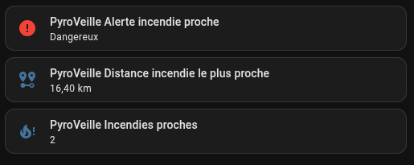
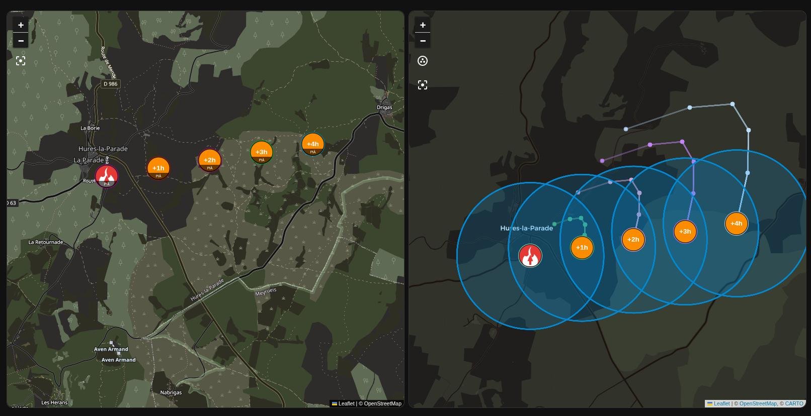

# PyroVeille

Integration Home Assistant custom compatible HACS pour surveiller les signalements d'incendies publies par [feuxdeforet.fr](https://feuxdeforet.fr/).

## Soutenir le projet

Si PyroVeille vous est utile, vous pouvez soutenir le projet via Buy Me a Coffee :

[https://buymeacoffee.com/vicar](https://buymeacoffee.com/vicar)


## Fonctionnalites

- Recuperation des signalements recents via `https://feuxdeforet.fr/api/signalements/recent` et des feux cartographiques via `https://feuxdeforet.fr/fdf/cartographie/geojson?scope=web`.
- Selection d'une zone par adresse et rayon en kilometres.
- Filtre optionnel par departements.
- Filtre optionnel sur les feux courants uniquement : feux actifs et signalements jaunes conserves, feux clotures ignores.
- Notification persistante Home Assistant lorsqu'un nouvel incendie entre dans le perimetre.
- Notification Telegram optionnelle via un service legacy `notify.telegram` ou une entite `notify.*` existante dans Home Assistant.
- Evenement Home Assistant `pyroveille_nearby_fire` pour declencher vos propres automatisations.
- Entites `device_tracker` GPS pour afficher les incendies proches sur la carte Home Assistant.
- Projection automatique de trajectoire basee sur le vent local Open-Meteo.
- Suivi live optionnel des avions et helicos visibles sur la carte FeuxDeForet, rafraichi toutes les 10 secondes, avec trace, cap, vitesse et altitude quand disponibles.
- Fallback ADS-B filtre sur les moyens Securite Civile pour recuperer aussi des Canadair/Pelican absents du flux FeuxDeForet quand ils sont visibles publiquement.
- Geocodage optionnel des communes lorsque la route publique ne fournit pas de coordonnees.

## Installation HACS

1. Dans HACS, ajoutez ce depot comme depot personnalise : `https://github.com/vico34/pyroveille`.
2. Categorie: `Integration`.
3. Installez `PyroVeille`.
4. Redemarrez Home Assistant.
5. Ajoutez l'integration depuis `Parametres > Appareils et services`.

## Configuration

Champs principaux :

- `Adresse du centre`: adresse utilisee comme centre de la zone surveillee.
- `Rayon`: perimetre de surveillance en kilometres.
- `Departements a inclure`: optionnel, separes par virgules, exemple `13, 83, 34`.
- `Limiter aux feux en cours`: ignore les signalements clotures/inactifs. Les feux signales en jaune restent inclus pour permettre une alerte precoce.
- `Creer une notification persistante`: cree une notification Home Assistant sur nouvel incendie proche.
- `Notifier seulement sous cette distance`: seuil optionnel en kilometres. `0` desactive le seuil.
- `Inclure le lien feuxdeforet.fr`: ajoute ou retire le lien source dans les notifications.
- `Notifier via Telegram`: envoie aussi l'alerte via Telegram si la cible `notify` configuree est disponible.
- `Service ou entite Telegram notify`: service legacy, par exemple `telegram` pour `notify.telegram`, ou entite moderne, par exemple `notify.telegram_bot_chat`.
- `Mode de geocodage`: `Adresse puis commune` utilise l'API Adresse officielle puis Nominatim en secours. `Adresse stricte` limite le geocodage a l'API Adresse officielle.
- `Geocoder les communes sans coordonnees natives`: utilise Nominatim/OpenStreetMap pour placer les signalements sur la carte quand feuxdeforet.fr ne fournit pas de latitude/longitude.
- `Activer les projections automatiques`: cree les points de projection sur la carte et recupere la meteo locale. Desactivez cette option pour garder uniquement les alertes et marqueurs d'incendie.
- `Activer le suivi live avions et helicos`: cree des marqueurs GPS pour les moyens aeriens publies par la carte FeuxDeForet et complete avec un fallback ADS-B filtre sur les Canadair/Pelican, Dash/Milan et helicos Dragon. Active par defaut en beta, mais desactivable si le flux live n'est pas utile.

## Entites creees

- `binary_sensor.alerte_incendie_proche`: actif si au moins un incendie est dans le perimetre.
- `sensor.incendies_proches`: nombre d'incendies dans le perimetre.
- `sensor.distance_incendie_le_plus_proche`: distance en km du signalement le plus proche.
- `sensor.derniere_mise_a_jour_pyroveille`: date de la derniere recuperation reussie.
- `device_tracker.*`: un marqueur GPS par incendie proche, visible sur la carte Home Assistant.
- `device_tracker.pyroveille_fire_*_projection_*`: marqueurs de projection automatique de trajectoire quand la meteo locale est disponible, avec un libelle temporel comme `+1h`.
- `device_tracker.pyroveille_fire_*_satellite_zone`: zone satellite estimee FIRMS, affichee comme un cercle GPS quand des hotspots sont disponibles.
- `device_tracker.pyroveille_hotspot_*`: points satellite NASA FIRMS en beta, si les zones satellite sont activees et qu'une cle MAP_KEY est configuree.
- `device_tracker.pyroveille_aircraft_*`: moyens aeriens live, si le suivi avions/helicos est active. FeuxDeForet est rafraichi toutes les 10 secondes et le fallback ADS-B toutes les 60 secondes. Les attributs exposent notamment `aircraft_type`, `category_label`, `callsign`, `registration`, `source`, `heading`, `speed_kmh`, `altitude_m` et `track_geojson`.

## Apercu






## Exemple de carte

Apres une premiere alerte, ajoutez les entites `device_tracker` creees par PyroVeille dans une carte Home Assistant. La carte native `map` utilise OpenStreetMap :

```yaml
type: map
title: Incendies PyroVeille
default_zoom: 9
hours_to_show: 24
entities:
  - entity: device_tracker.nom_de_l_incendie_pyroveille
```

Les noms exacts des entites sont visibles dans `Parametres > Appareils et services > Entites`, en filtrant sur `PyroVeille`. Les marqueurs PyroVeille sont rouges pour les feux actifs, jaunes pour les feux signales/probables/douteux et gris pour les feux inactifs.

Pour afficher automatiquement toutes les entites `device_tracker.pyroveille_*`, installez la carte custom `auto-entities` via HACS :

```yaml
type: custom:auto-entities
card:
  type: map
  title: Incendies PyroVeille
  default_zoom: 9
  hours_to_show: 24
filter:
  include:
    - entity_id: device_tracker.pyroveille_*
  exclude:
    - attributes:
        fire_status: inactive
show_empty: false
```

## Projection automatique de trajectoire

La version `0.3.0` genere automatiquement une projection pour chaque incendie proche disposant de coordonnees et d'une meteo locale disponible, si l'option `Activer les projections automatiques` est activee.

PyroVeille recupere automatiquement le vent courant autour de l'incendie via Open-Meteo :

- vitesse du vent a 10 m ;
- direction du vent a 10 m ;
- rafales a 10 m.

La direction utilisee est la direction sous le vent. Les marqueurs de projection affichent le delai estime depuis le depart du feu, par exemple `+1h`, `+2h`, `+3h` ou `+4h` avec l'horizon par defaut. La vitesse de progression reste une heuristique interne derivee du vent, pas une prevision officielle. Aucun parametre manuel n'est demande a l'utilisateur.

## Beta : zones satellite FIRMS

La version `0.4.0-beta.5` permet de tester une zone satellite estimee autour des incendies proches via NASA FIRMS, avec une carte custom capable d'afficher une zone difforme transparente.

Options a configurer :

- `Activer les zones satellite FIRMS`: active la recuperation des hotspots satellite.
- `NASA FIRMS MAP_KEY`: cle gratuite a demander sur le site NASA FIRMS.
- `Source satellite FIRMS`: source de donnees, par defaut `VIIRS S-NPP NRT`.
- `Rayon de recherche FIRMS`: rayon autour de chaque incendie pour chercher les hotspots, par defaut `25 km`.

Quand des hotspots sont disponibles, PyroVeille cree :

- des entites `device_tracker.pyroveille_hotspot_*` pour afficher les detections satellite ;
- une entite `device_tracker.pyroveille_fire_*_satellite_zone` par incendie, centree sur les hotspots et avec `location_accuracy` egal au rayon estime ;
- un attribut `satellite_zone` sur le marqueur principal de l'incendie, avec un objet `geojson` de type `Polygon`.

Sur la carte native Home Assistant, l'entite `device_tracker.pyroveille_fire_*_satellite_zone` permet d'afficher un cercle GPS correspondant a la zone estimee. Pour voir cette zone, ajoutez aussi ces entites dans votre carte ou utilisez le filtre automatique `device_tracker.pyroveille_*`.

Pour afficher une seule zone difforme, ajoutez la carte custom PyroVeille dans `Parametres > Tableaux de bord > Ressources` :

```text
/pyroveille_static/pyroveille-map-card.js
```

Type de ressource : `Module JavaScript`.

Exemple de carte Lovelace :

```yaml
type: custom:pyroveille-map-card
title: Incendies PyroVeille
height: 520px
show_satellite_zones: true
show_hotspots: true
show_projections: true
show_aircraft: true
```

La carte utilise OpenStreetMap/Leaflet et lit automatiquement les entites `device_tracker.pyroveille_*`. Depuis `0.4.0-beta.5`, elle detecte aussi les entites PyroVeille renommees via leurs attributs (`fire_status`, `satellite_zone`, `satellite_hotspot`, `projection`) et deduplique les polygones. Depuis `0.4.0-beta.7`, les entites avion/helico sont detectees via l'attribut `aircraft`, et leur trace est dessinee depuis `track_geojson` quand elle est disponible.

Si vous voulez forcer certaines entites, ajoutez-les explicitement :

```yaml
type: custom:pyroveille-map-card
entities:
  - device_tracker.mon_incendie_renomme
  - device_tracker.ma_zone_satellite_renommee
```

Leaflet est embarque dans l'integration depuis `0.4.0-beta.4`, la carte ne depend donc plus du chargement externe depuis un CDN.

Apres une mise a jour de beta, rechargez le navigateur ou supprimez/recreez la ressource Lovelace si Home Assistant conserve l'ancien JavaScript en cache.

Important : cette zone est une estimation issue de detections satellite. Elle ne represente pas un contour officiel du feu ni une zone d'intervention.

## Automatisation mobile

L'integration cree deja une notification persistante si l'option est active. Pour envoyer aussi une notification mobile, utilisez l'evenement :

```yaml
alias: Alerte incendie proche
mode: queued
trigger:
  - platform: event
    event_type: pyroveille_nearby_fire
action:
  - service: notify.mobile_app_votre_telephone
    data:
      title: "Alerte incendie proche"
      message: >
        {{ trigger.event.data.title }} a {{ trigger.event.data.distance_km | round(1) }} km.
      data:
        url: "{{ trigger.event.data.url }}"
```

## Notes sur la source

Feux de Foret expose sur son site public une carte "Feux en cours" et des routes JSON publiques utilisees par le frontend. PyroVeille combine `https://feuxdeforet.fr/api/signalements/recent` pour les informations lisibles et `https://feuxdeforet.fr/fdf/cartographie/geojson?scope=web` pour les coordonnees et statuts de carte. Les statuts cartographiques `signale`, `probable`, `douteux` et `en_attente` sont normalises en `reported` et affiches en jaune.

L'adresse de surveillance et les communes sans coordonnees natives sont geocodees via Nominatim/OpenStreetMap. Lorsque les coordonnees ne sont pas publiees dans cette route, le placement carte est approximatif et base sur la commune. Les notifications doivent donc etre considerees comme une aide de surveillance, pas comme une source officielle d'alerte securite.
