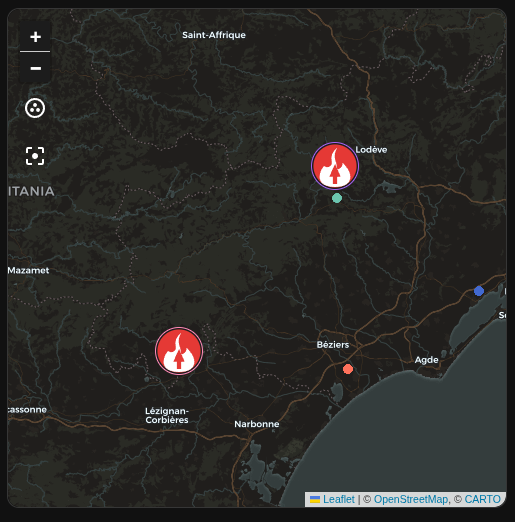

# Entites

PyroVeille cree les entites suivantes.

## Capteurs

- `binary_sensor.alerte_incendie_proche`: actif si au moins un incendie est dans la zone.
- `sensor.incendies_proches`: nombre d'incendies dans le perimetre.
- `sensor.distance_incendie_le_plus_proche`: distance du signalement le plus proche.
- `sensor.derniere_mise_a_jour_pyroveille`: date de la derniere recuperation reussie, avec `last_error`, la liste des entites carte et les entites de projection en attributs.

## Carte

Des entites `device_tracker` GPS sont creees pour les incendies proches disposant de coordonnees. Elles exposent `latitude`, `longitude` et `source_type = gps`, ce qui les rend visibles dans la carte native Home Assistant.

Si la source ne fournit pas de coordonnees, PyroVeille peut geocoder la commune pour obtenir une position approximative.

Depuis `0.3.0`, PyroVeille cree aussi des entites de projection automatique quand la meteo locale est disponible pour l'incendie. Les entites suivent ce format :

```text
device_tracker.pyroveille_fire_<id>_projection_25
device_tracker.pyroveille_fire_<id>_projection_50
device_tracker.pyroveille_fire_<id>_projection_75
device_tracker.pyroveille_fire_<id>_projection_100
```

Ces points representent 25%, 50%, 75% et 100% de l'horizon interne de projection. Leur marqueur affiche un libelle temporel, par exemple `+1h`, `+2h`, `+3h` ou `+4h` avec l'horizon par defaut.

Depuis `0.4.0-beta.1`, PyroVeille peut aussi creer des entites beta de hotspots satellite NASA FIRMS :

```text
device_tracker.pyroveille_hotspot_<id>
```

Ces points representent des detections satellite proches d'un incendie. Ils aident a visualiser une zone active estimee, mais ne sont pas un contour officiel.

Depuis `0.4.0-beta.2`, PyroVeille cree aussi une entite de zone satellite estimee par incendie quand des hotspots FIRMS sont disponibles :

```text
device_tracker.pyroveille_fire_<id>_satellite_zone
```

Cette entite est centree sur les hotspots detectes et utilise `location_accuracy` pour exposer le rayon estime en metres. Sur la carte native Home Assistant, elle peut donc apparaitre comme un cercle GPS autour de la zone estimee.

Depuis `0.4.0-beta.3`, l'attribut `satellite_zone` contient aussi un objet `geojson` de type `Polygon`. Ce polygone est une enveloppe estimee autour des hotspots FIRMS et permet a la carte custom PyroVeille d'afficher une zone difforme transparente.

Quand le suivi live avions et helicos est active, PyroVeille cree aussi des entites :

```text
device_tracker.pyroveille_aircraft_<id>
```

Ces entites representent les moyens aeriens publies par la carte FeuxDeForet. Elles exposent `aircraft_type`, `category_label`, `callsign`, `registration`, `heading`, `speed_kmh`, `altitude_m` et `track_geojson` quand ces donnees sont disponibles.

## Exemple de carte Lovelace

Apres une premiere detection, Home Assistant cree une entite `device_tracker` par incendie proche. La carte native `map` de Home Assistant utilise OpenStreetMap. Ajoutez les entites PyroVeille dans cette carte :

```yaml
type: map
title: Incendies PyroVeille
default_zoom: 9
hours_to_show: 24
entities:
  - entity: device_tracker.nom_de_l_incendie_pyroveille
```

Les noms exacts sont visibles dans `Parametres > Appareils et services > Entites`, en filtrant sur `PyroVeille`. Remplacez l'exemple par une ou plusieurs entites `device_tracker` generees par l'integration.

## Carte automatique avec toutes les entites PyroVeille

La carte native `map` ne sait pas selectionner des entites avec un joker comme `device_tracker.pyroveille*`. Pour alimenter automatiquement la carte avec toutes les entites PyroVeille, installez la carte custom `auto-entities` via HACS, puis utilisez :

```yaml
type: custom:auto-entities
card:
  type: map
  title: Incendies PyroVeille
  default_zoom: 9
  hours_to_show: 24
filter:
  include:
    - entity_id: device_tracker.pyroveille_*
  exclude:
    - attributes:
        fire_status: inactive
show_empty: false
```

Les nouvelles entites PyroVeille sont creees avec un identifiant suggere commencant par `device_tracker.pyroveille_`, ce qui permet a ce filtre de les afficher automatiquement.
Supprimez le bloc `exclude` si vous voulez afficher aussi les feux inactifs.

## Carte custom PyroVeille

Pour afficher les zones satellite sous forme de polygone difforme, ajoutez la ressource Lovelace suivante dans `Parametres > Tableaux de bord > Ressources` :

```text
/pyroveille_static/pyroveille-map-card.js
```

Type de ressource : `Module JavaScript`.

Puis ajoutez une carte manuelle :

```yaml
type: custom:pyroveille-map-card
title: Incendies PyroVeille
height: 520px
show_satellite_zones: true
show_hotspots: true
show_projections: true
show_aircraft: true
```

La carte utilise OpenStreetMap/Leaflet et lit automatiquement les entites `device_tracker.pyroveille_*`. Depuis `0.4.0-beta.4`, Leaflet est embarque localement dans l'integration pour eviter les blocages ou lenteurs de chargement CDN. Depuis `0.4.0-beta.5`, la carte detecte aussi les entites PyroVeille renommees via leurs attributs et deduplique les polygones de zone. Depuis `0.4.0-beta.7`, les entites avion/helico sont detectees via l'attribut `aircraft`, et leur trace est dessinee depuis `track_geojson`.

## Couleur des marqueurs

PyroVeille expose une image de marqueur differente selon le statut du feu :

- rouge : feu actif ;
- gris : feu inactif ou termine ;
- orange : point de projection automatique, avec libelle temporel de progression.
- orange fonce : hotspot satellite FIRMS beta.
- cercle orange transparent : zone satellite estimee FIRMS beta, si la carte affiche le cercle de precision GPS.
- polygone orange transparent : zone satellite estimee FIRMS beta dans la carte custom PyroVeille.
- bleu : avion de lutte incendie ou moyen aerien non classe.
- vert : helicoptere.

## Captures




Chaque entite `device_tracker` contient aussi :

- `fire_status`: `active` ou `inactive` ;
- `marker_color`: couleur HTML du marqueur.
- `bearing`: direction estimee de projection en degres pour les marqueurs de projection ;
- `projection_label`: libelle temporel affiche sur les marqueurs de projection.
- `satellite_zone`: zone satellite estimee pour les marqueurs d'incendie, si FIRMS est active et si des hotspots sont disponibles.
- `estimated_radius_m`: rayon estime en metres sur les entites `device_tracker.pyroveille_fire_*_satellite_zone`.
- `geojson`: polygone estime de la zone satellite dans l'attribut `satellite_zone`.
- `aircraft`: `true` pour les moyens aeriens live.
- `track_geojson`: trace du moyen aerien, si disponible.

Si votre tableau de bord n'affiche pas l'image du marqueur, supprimez puis rajoutez la carte apres la premiere detection, ou ajoutez explicitement les nouvelles entites `device_tracker` PyroVeille dans la liste `entities`.
